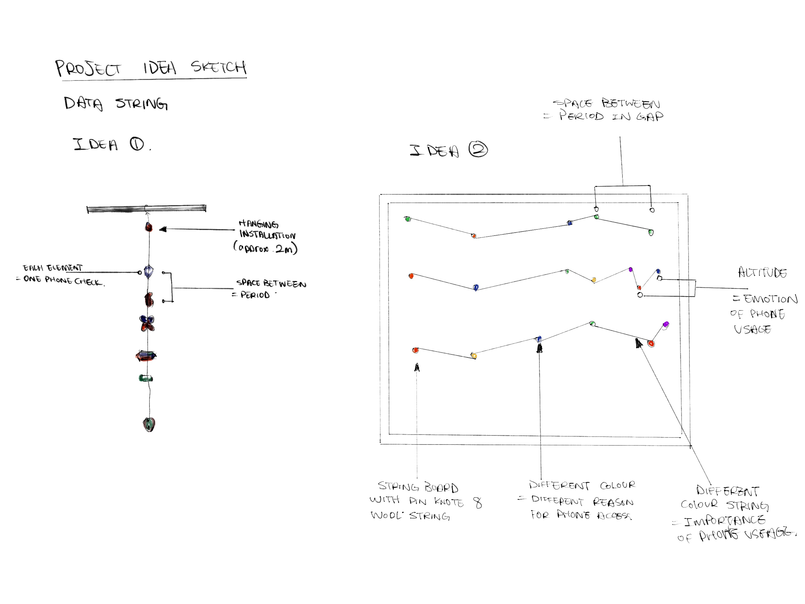
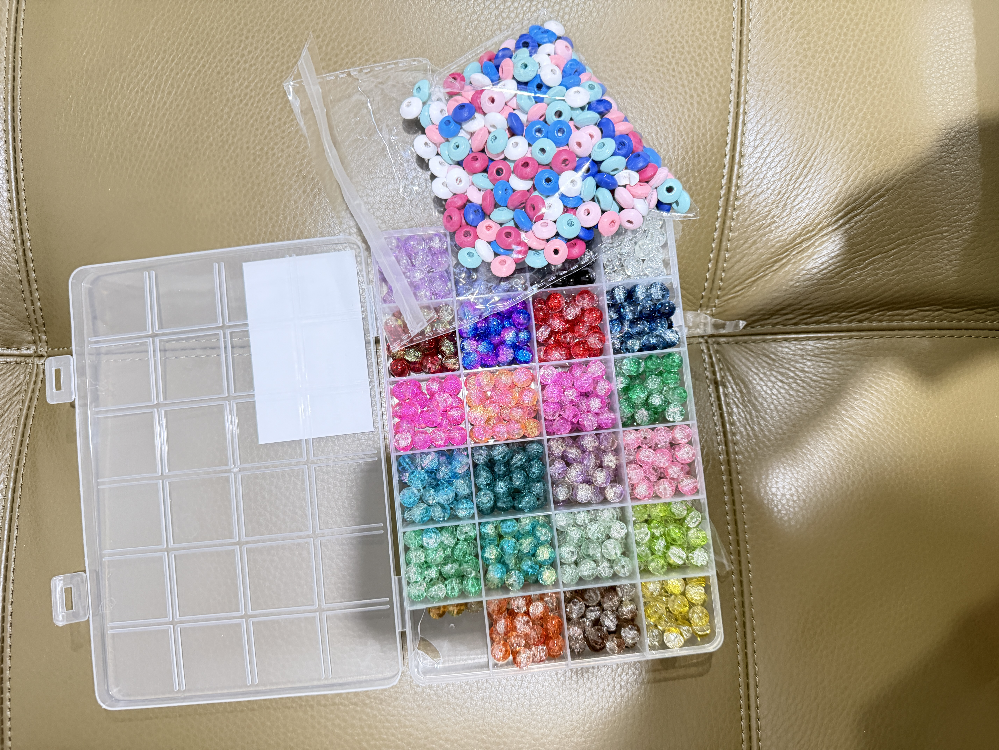
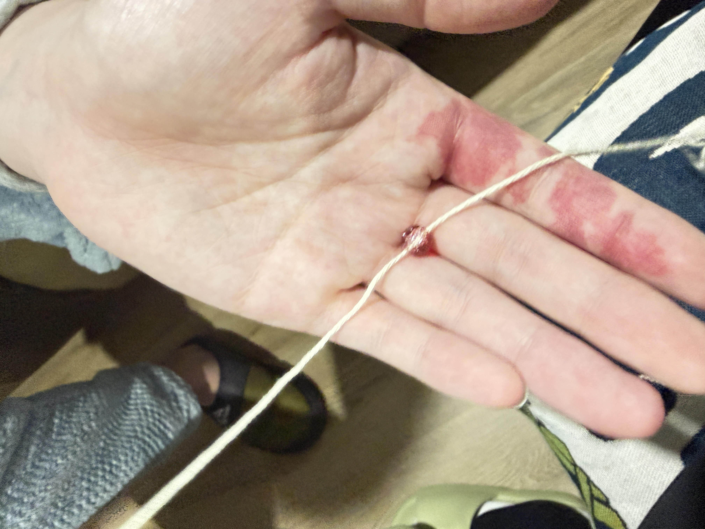
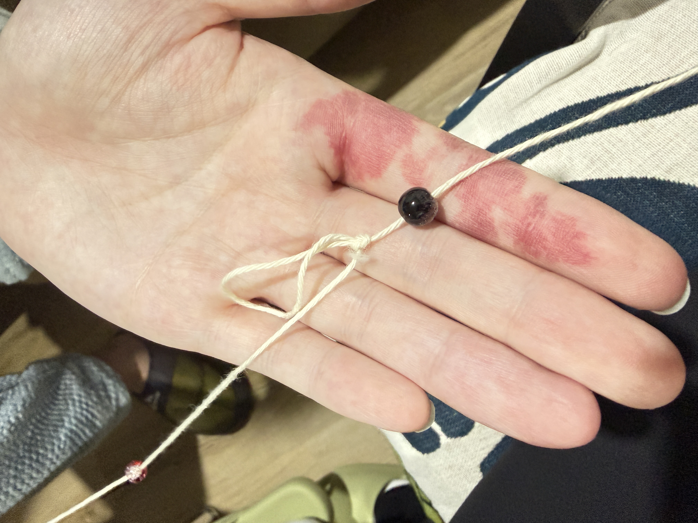
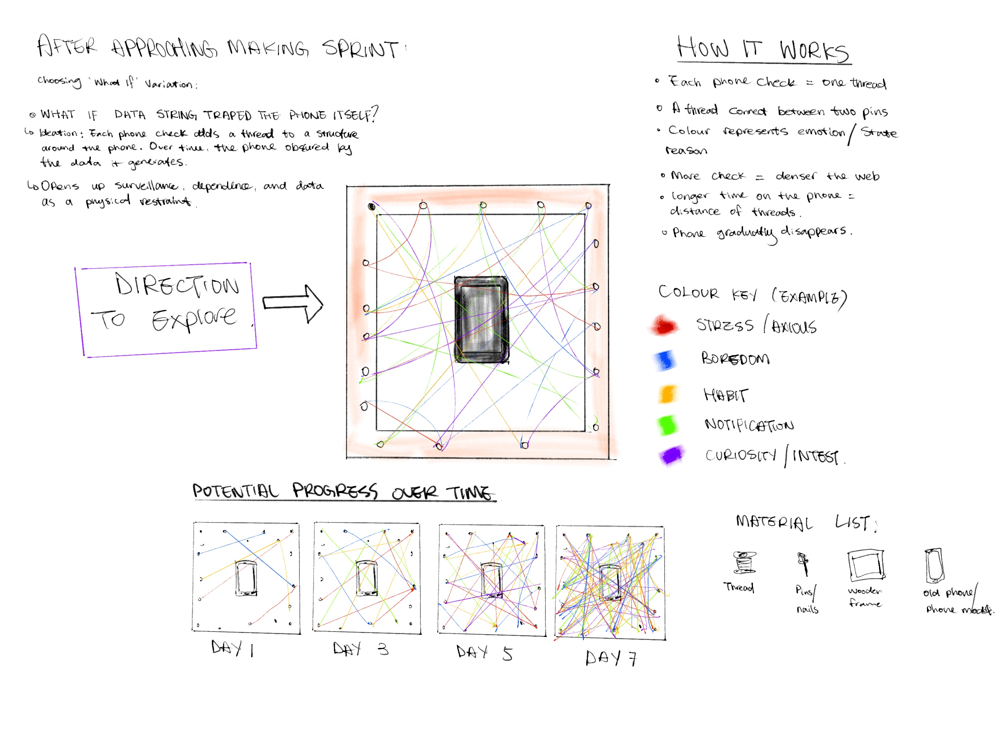
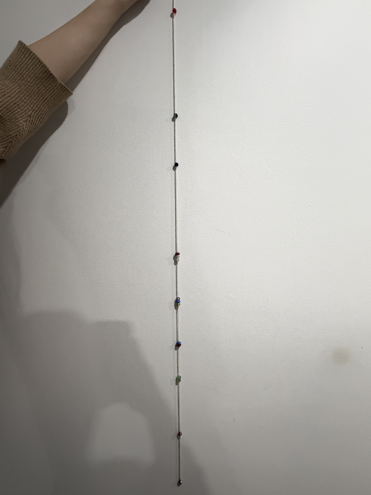
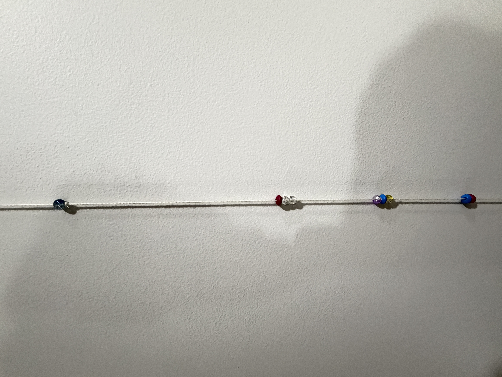
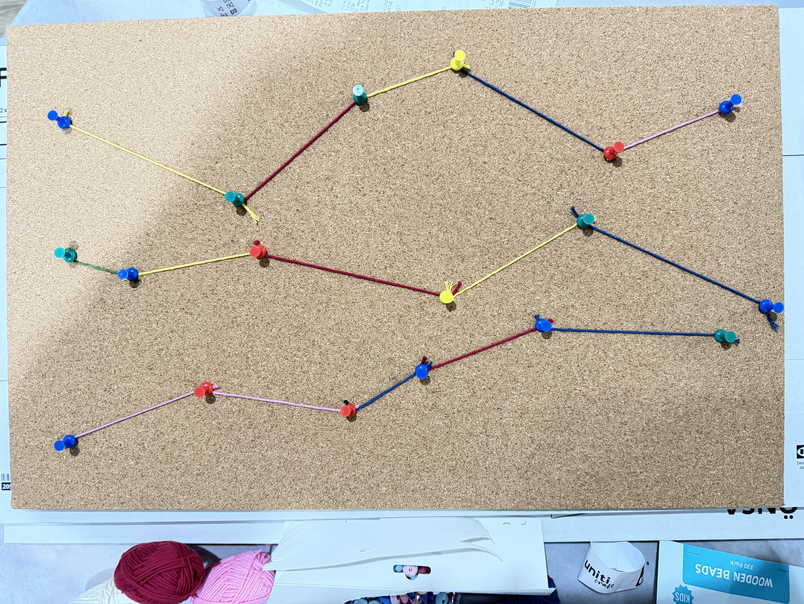

# Week 07

[← Back to Home](../index.md)

## Make Sprint

For this making sprint, I created a rough prototype of my hanging data string visualisation. Rather than collecting several days of data, I used a small sample of hypothetical phone-checking interactions to test the physical system and understand how data might be translated into material form.

I used wool string, coloured paper pieces, knots, and small found objects to represent different moments of phone checking. Each object represented one interaction, while colour indicated a possible emotional state or reason for checking the phone. For example, blue represented boredom, red represented stress or anxiety, yellow represented habitual checking, and green represented responding to notifications. I also experimented with leaving different amounts of space between elements to represent gaps in time between phone interactions.

The main goal of this prototype was to test whether patterns could emerge through accumulation. As I added more elements to the string, I noticed clusters forming naturally where many interactions occurred close together. Longer empty spaces also became visually noticeable and suggested periods of reduced phone activity. This showed that spacing may be more effective than I originally expected as a way of representing time.

During the experiment, I discovered that using too many different materials quickly became confusing. While the variety added visual interest, it made the encoding system harder to read. In future iterations, I will simplify the material language and focus on a smaller number of variables. I also found that the hanging format creates a strong sense of growth and accumulation because the structure physically extends downward as data is added.

This prototype reinforced my interest in data physicalisation and accumulation. Rather than functioning like a chart, the piece begins to operate as a record of behaviour that can be experienced spatially. The experiment demonstrated that the concept is feasible and provided useful insights into materials, spacing, and encoding systems that I can refine in future iterations. 

*Sketch of ideas* 

*Using different charms, with glass marble and wood charms*

*Crating documentation*

## 'What If' Variation

What if #1

What if the string does not only record phone checks, but physically fights back? Every phone check adds weight to the structure, making it heavier and more difficult to hang.

What if #2

What if the string is not chronological? Instead of showing time, the elements reorganise themselves into emotional clusters, creating a map of your attention rather than a timeline.

What if #3 (Most Interesting)

What if the data string becomes a cage or web around the phone itself? The more the phone is checked, the more thread is added around it, gradually obscuring the object that generated the data.

I would choose What if #3 because it develops your current idea while making the relationship between behaviour and data much more visible and provocative.
## Project Development & Skill Building

### Partner Feedback and Alternative Direction

After presenting my making sprint, my partner suggested several alternative directions for the project. The most interesting suggestion was: "What if the data string gradually surrounds the phone itself?"

Instead of creating a hanging timeline of phone interactions, this version would use the collected data to build a growing web of thread around a physical phone. Every time I unconsciously check my phone, another piece of thread would be added to the structure. Over time, the phone would become increasingly wrapped, obscured, or trapped by the accumulation of its own data.

This differs from my current approach because the focus shifts from visualising behaviour over time to visualising the consequences of repeated behaviour. The current hanging string emphasises accumulation and patterns, while the alternative version creates a stronger symbolic relationship between the object and the data it produces.

The structure could begin with a phone placed in the centre of a frame. Each recorded interaction would add another strand of coloured thread connected to surrounding points. Different colours could still represent emotional states or reasons for checking the phone, but the primary visual effect would be increasing density. Areas of heavy phone use would create thicker clusters of thread, eventually making the phone difficult to see.

This variation opens up new conceptual questions about surveillance, dependence, and digital habits. The phone becomes physically consumed by the data generated through interaction with it. Rather than simply recording behaviour, the work suggests how technology and data collection can gradually shape, constrain, or overwhelm everyday life.

Although I am still interested in pursuing the hanging data string as my primary direction, this experiment helped me think about how accumulation could become more spatial, symbolic, and provocative.

### Ideas After FeedBack and Alternative

Chosen variation: #3 What if the data string trapped the phone itself? 

A phone is placed in the centre of a frame, and each time I unconsciously check my phone, a coloured thread is added between two pins. Different colours represent different reasons for checking the phone, such as boredom, habit, stress, or notifications.

As more interactions are recorded, the web of threads becomes denser and gradually obscures the phone. The work transforms an invisible daily habit into a visible physical structure, highlighting how behavioural data accumulates over time. Unlike my original hanging data string, this version focuses on the relationship between the phone and the data it generates, creating a stronger commentary on dependence, surveillance, and digital habits.

### Crafting and Experimenting

*Outcome For Idea 1*

*Outcome For Idea 2*

## Progress Report
Following my proposal and initial concept sketches, I produced two physical prototypes to test different approaches for visualising phone-checking behaviour.

The first prototype explored the original hanging data string concept. Using thread and coloured beads, I tested how individual phone interactions could be represented through physical accumulation over time. The spacing between beads was intended to represent time gaps, while colour could potentially represent different emotional states or reasons for checking the phone. This prototype successfully demonstrated the idea of accumulation and growth, but I found that the linear format limited the amount of information that could be communicated visually.

The second prototype explored the string-board mapping system. Using coloured thread and pins on a cork board, I tested how phone interactions might be represented through movement, connection, and changing emotional states. This approach felt more dynamic and visually engaging, as patterns began to emerge through the crossing lines and changing directions. It also introduced the possibility of representing relationships between different emotional states rather than simply showing a timeline.

Skill Building:

Through these experiments, I developed several practical skills related to both data collection and data representation. While creating the hanging data string, I learned how to translate behavioural observations into a physical encoding system using colour, spacing, and material choices. This required thinking critically about what information was important to record and how it could be communicated through simple visual elements. The process also highlighted the challenges of collecting subjective data consistently, as I needed to decide what constituted a phone interaction and how different emotional states could be categorised.

The string-board prototype helped me develop skills in organising and mapping data spatially rather than linearly. By connecting pins with coloured threads, I explored how relationships, movement, and patterns could emerge from the data. This experiment taught me that data visualisation is not only about displaying information but also about making design decisions that influence interpretation. Both prototypes improved my understanding of data physicalisation and demonstrated how materials, structure, and form can communicate information beyond traditional charts or graphs.