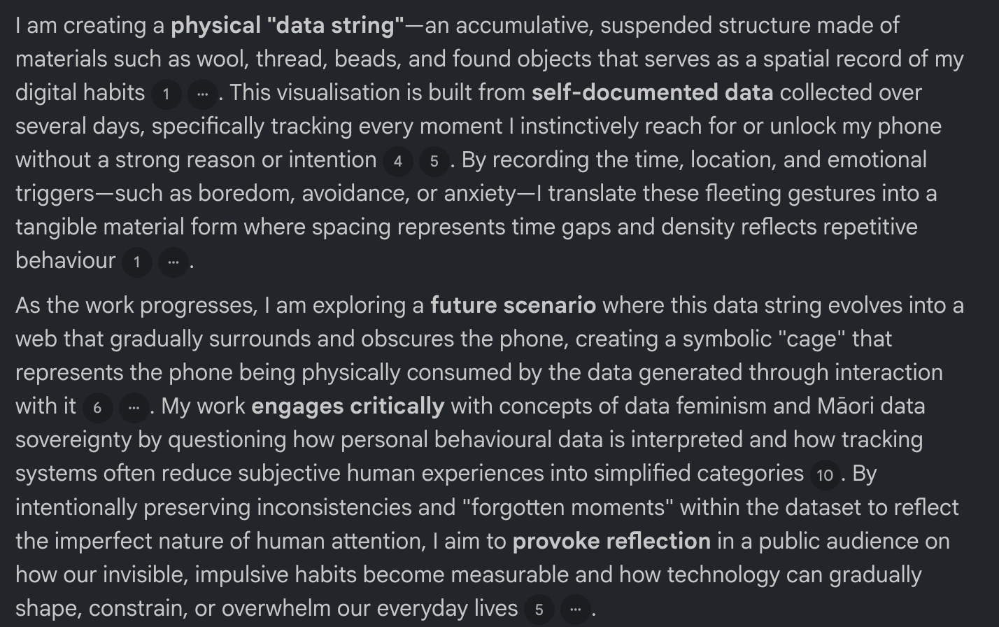

# Week 09

[← Back to Home](../index.md)

## Project Statement-First Draft

The feedback highlighted that the strongest aspect of the project is the physical translation of behavioural data through accumulation. The use of spacing, knots, beads, and thread effectively communicates periods of high and low phone activity, creating a tactile experience that differs from traditional digital visualisations. Narrowing the focus from general attention and distraction to unconscious phone-checking behaviour has also strengthened the project by making the data collection more specific and meaningful. The alternative concept of wrapping the phone in thread was identified as a particularly strong direction because it creates a symbolic relationship between the device and the data it generates.

However, several areas still require development. The current material system is too complex and needs simplification to improve clarity and readability. The final installation format also remains unresolved, with possibilities including a hanging structure, multiple strands, or a surface-based installation. The data collection method needs further testing to ensure it is simple enough to use consistently while still capturing emotional and contextual information.

The feedback also noted that some conceptual areas, particularly data feminism and Māori data sovereignty, are not yet fully integrated into the work. Future research should focus on these themes, as well as methods for representing forgotten moments, missing data, and behavioural gaps. Overall, the feedback reinforced my commitment to creating a physical data visualisation that transforms unconscious phone-checking habits into a tangible and accumulating structure.

## Round Robin Rapid Reaction
*Again I cound not make to the class with the activities, but I have tried my best to grant feedback from classmate and AI tools*

One of the most common responses was that the project's provocation was becoming clearer through the focus on unconscious phone-checking behaviour. Classmates understood the idea of making invisible habits visible and found the accumulation of data through physical materials engaging. Several people commented that the project encouraged them to reflect on their own relationship with their phones and how often they check them without intention.

The making sprint outcomes suggested two possible directions: the hanging data string and the string-board system. Most visitors found the string-board concept more visually engaging because it could show relationships, patterns, and emotional states rather than only recording accumulation over time. They suggested expanding the visual language by using additional variables such as shape, colour, and scale to represent different emotional triggers and levels of intensity.

A recurring question was how the final installation would be presented during the Week 12 showcase. While the concept is clear, the final form remains unresolved. Feedback suggested simplifying the material system and developing a clearer method for encoding emotions and behavioural triggers. Several visitors also encouraged me to continue exploring the idea of the phone becoming trapped or obscured by its own data, as this was seen as a stronger and more provocative visual statement.

This feedback reinforced the importance of refining both the data collection method and the material language. Moving forward, I plan to simplify the visual encoding system, test different installation formats, and continue collecting data to understand which physical form most effectively communicates the accumulation of unconscious phone habits.

**Presentation Feedback With Using AI Tool**

Does the project statement clearly outline a provocation?
Yes. The project clearly explores how unconscious phone-checking habits can be transformed into visible and physical data. The idea of making invisible behaviours tangible encourages reflection on digital dependence and personal data generation.

What does the sprint outcome suggest about where the project is heading?
The prototypes demonstrate a move from simply recording behaviour towards creating a more conceptual and symbolic representation of phone use. The string-board system and the idea of the phone becoming trapped by data suggest a stronger focus on accumulation, consequence, and behavioural patterns.

What does this work make you think or feel about its subject matter?
The work makes me more aware of how often phone interactions happen automatically without conscious intention. The accumulation of physical materials highlights how small actions can build into larger patterns over time, creating a sense of both curiosity and discomfort about digital habits.

What needs to be resolved before the Week 12 showcase?
The final installation format needs to be decided, including whether the project will take the form of a hanging structure, string-board, or phone-entrapment installation. The visual encoding system should also be simplified and clarified so viewers can easily understand the relationship between colour, shape, emotion, and behaviour. Finally, the data collection method needs to be consistently tested to ensure meaningful patterns emerge in the final outcome.

## Project Development

*Day1*

*Day3*

Following feedback from my proposal and making experiments, I continued developing the concept of representing unconscious phone-checking behaviour through physical accumulation. The project evolved from the original hanging data string into a more spatial installation where the phone itself becomes surrounded by the data it generates.

In this experiment, a phone is placed at the centre of a cork board surrounded by pins. Each time I unconsciously check my phone, a coloured thread is added between two points on the board. The colour represents the emotional state or reason behind the interaction, such as boredom, habit, stress, curiosity, or responding to a notification.

The photographs document the progression of the work over time rather than separate prototypes. In the earlier stage, only a small number of interactions have been recorded. The phone remains clearly visible, and the surrounding structure appears open. As more data is collected, additional threads are added to the system. The density of the web increases, intersections become more frequent, and the phone gradually becomes visually trapped within the structure.

This development helped me understand how accumulation can function as both a method of data collection and a visual language. Rather than displaying data as numbers or statistics, the project transforms behavioural information into a physical object that grows over time. The increasing density of the threads makes the effects of repeated phone checking visible and tangible.

Through this process, I developed skills in translating behavioural data into physical form, creating a visual encoding system using colour and spatial relationships, and designing a method of data collection that is integrated into the making process itself. I also learned how density, repetition, and material accumulation can communicate information without relying on traditional charts or graphs.

The experiment reinforced the project's central provocation: the more the phone is checked, the more it becomes surrounded by the data it generates. This creates a physical representation of digital habits and encourages reflection on the relationship between behaviour, technology, and personal data.
## AI Usage Statement
AI tools, including ChatGPT and NotebookLM, were used throughout the project as reflective and brainstorming tools rather than generators of final outcomes. ChatGPT was used to help organise project documentation, develop written reflections, identify areas requiring further development, and generate alternative design directions during the ideation stage. NotebookLM was used to review project documents and provide feedback on strengths, weaknesses, unresolved issues, and future research directions.

The feedback generated by these tools informed decisions about narrowing the project focus from general attention and distraction to unconscious phone-checking behaviour. AI also helped identify opportunities to simplify the material system, strengthen the relationship between data collection and physical representation, and clarify the project's conceptual framing.

All data collection, material experimentation, prototyping, visual development, and final design decisions were completed independently. AI was used as a critical discussion partner to support reflection and iteration rather than to determine the final outcome of the project.

***OpenAI. (2025). ChatGPT (June 2025 version) [Large language model]. https://chatgpt.com***

***Google. (2025). NotebookLM [Large language model]. https://notebooklm.google.com***
