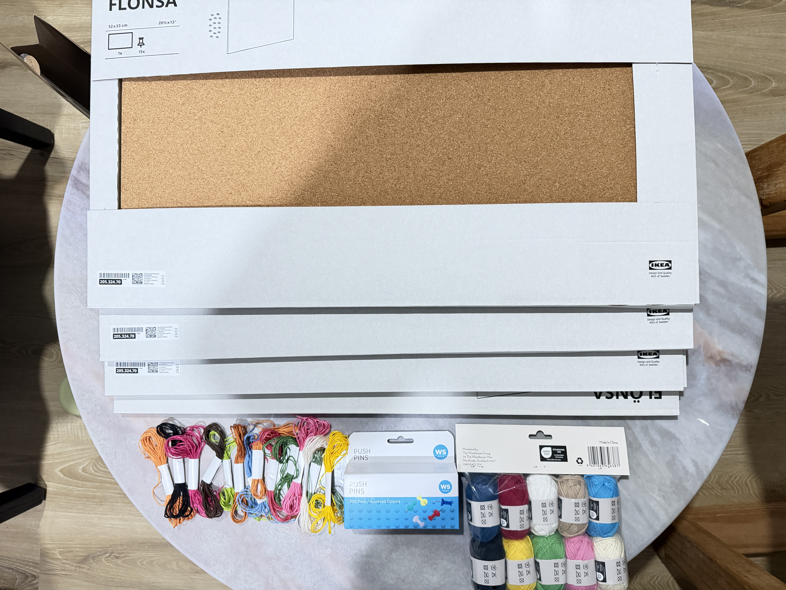

# Week 10

[← Back to Home](../index.md)

## Progress Report
*Still away from class but grant feedbacks online and triednmy best to develope the project*

After collecting feedback. I began thinking about how the work could move beyond a personal record of my own phone-checking behaviour and become more engaging for an audience. While the current installation successfully visualises the accumulation of unconscious phone interactions through the growing web of thread, the feedback suggested that viewers may connect more strongly with the project if they are able to participate in the data collection process themselves.

This led me to consider expanding the project into a comparison between personal and collective behavioural data. Instead of presenting only my own week of phone-checking data, I could create a second board that remains empty at the beginning of the exhibition. Visitors would be invited to reflect on the last time they checked their phone and contribute a coloured thread based on their reason for doing so. Over the course of the exhibition, the audience would gradually build their own data structure, allowing the work to continue growing in real time.

I find this direction interesting because it shifts the project from a personal self-observation exercise into a collective reflection on digital habits. The audience would become part of the dataset rather than simply observing it. This development also strengthens the project's connection to data humanism, as each contribution represents a personal experience rather than an anonymous statistic. By comparing my own data with the audience-generated data, the installation may reveal common patterns, differences, and shared behaviours that would otherwise remain invisible.

Moving forward, I would like to test how this participatory approach affects the visual outcome and whether audience contributions create a stronger emotional connection to the project's central question: how much of our interaction with phones happens unconsciously, and what might those accumulated habits reveal about us?

## Action Plan
The critique session provided valuable feedback that helped me think more critically about both the concept and presentation of my project. The most significant feedback was that while the project successfully visualises my unconscious phone-checking behaviour, it currently remains a personal dataset that the audience can only observe from the outside. Several people responded positively to the idea of the phone becoming trapped within the data it generates, as it creates a strong visual metaphor for digital habits, dependence, and data accumulation. However, they also suggested that the project could become more engaging if the audience had an opportunity to participate in the data collection process.

This feedback led me to consider expanding the installation beyond my own behavioural data. One idea that emerged was creating a second board that begins empty and gradually develops through audience participation during the exhibition. Visitors would reflect on the last time they checked their phone and contribute a coloured thread representing their reason for doing so. This would allow the project to compare individual and collective behaviour while making viewers active contributors rather than passive observers.

Another important point was the need to simplify and clarify the visual encoding system. The current use of colour and thread density is effective, but I need to ensure the meaning of each colour is immediately understandable to viewers. I also need to finalise the installation format and determine how audience contributions will be integrated into the work.

Moving forward, my key action points are to refine the visual language, test the audience participation system, continue collecting personal data, and develop clear instructions that help visitors engage with the installation. These changes will strengthen both the conceptual impact and the interactive experience of the final project.
## Project Development

Following the critique session, I decided to further develop my project by expanding it from a personal data visualisation into a participatory installation. The feedback highlighted that while the current work successfully visualises my unconscious phone-checking behaviour, the audience remains an observer rather than an active participant. This prompted me to rethink how the data collection process could become part of the exhibition experience.

My original installation consists of a phone positioned at the centre of a board surrounded by pins. Each time I unconsciously check my phone, I add a coloured thread to the structure. Over time, the accumulation of threads gradually obscures the phone, creating a physical representation of the data generated through repeated interactions. This visualises how small, seemingly insignificant actions accumulate into larger behavioural patterns.

For the next stage of development, I will introduce a second board that represents collective behaviour. The first board will display my own data collected over a week, while the second board will begin almost empty. During the exhibition, visitors will be invited to participate by reflecting on the last time they checked their phone and selecting a coloured thread that corresponds to their reason for doing so. They will then add the thread to the board, contributing their own data to the growing structure.

This development shifts the project from a personal reflection into a comparison between individual and collective habits. It also transforms the audience into contributors, allowing them to become part of the dataset rather than simply viewing the final outcome. As more participants contribute, the second board will gradually evolve into a collective portrait of phone-checking behaviour, revealing shared patterns and motivations.

At this stage, I will focus on refining the colour-coding system, testing audience instructions, and developing a clear installation format. I will also continue collecting my own data to complete the personal board. By combining self-tracking with audience participation, the project aims to encourage reflection on how frequently and unconsciously people interact with their phones, while making behavioural data visible through physical accumulation.

*More Material Purchased for the final Installation*